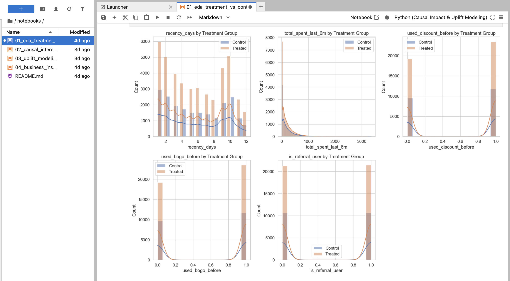
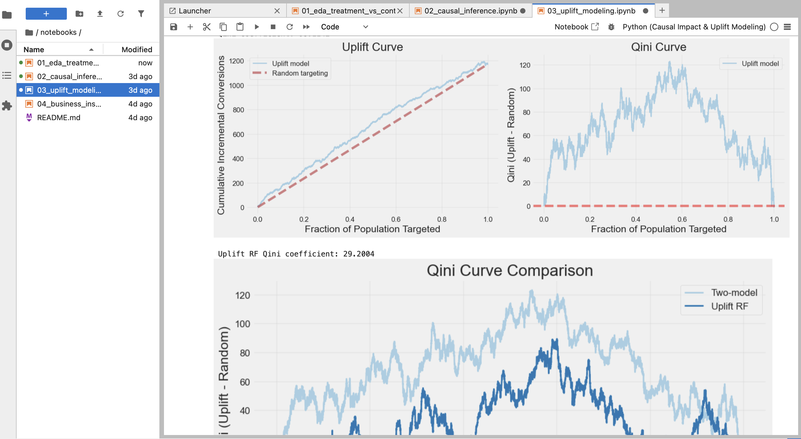
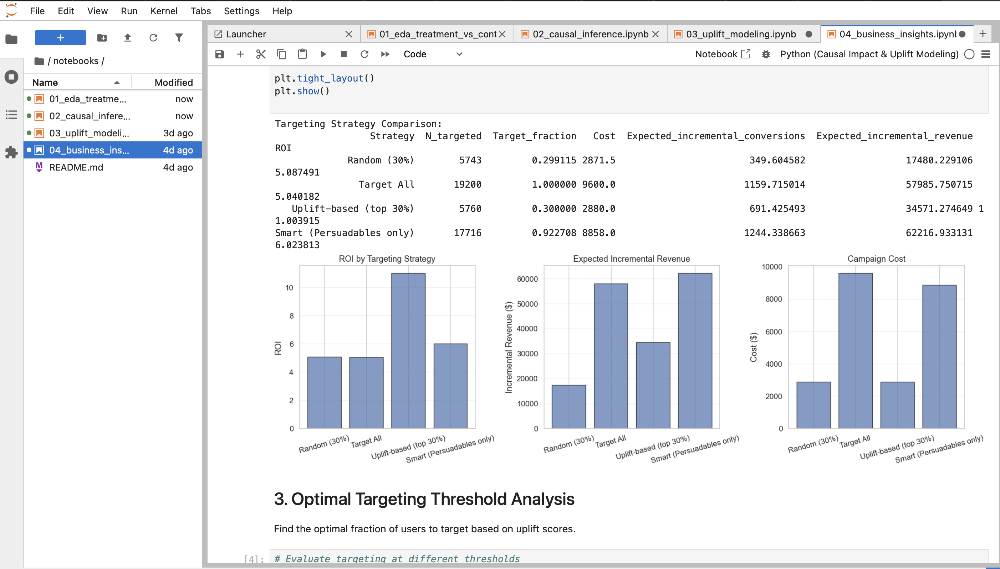

# Causal Inference and Uplift Modeling for Marketing Campaign Optimization

## Problem Statement

E-commerce companies invest significant resources in marketing campaigns to drive customer purchases. However, standard machine learning approaches that predict purchase probability fail to distinguish between customers who purchase because of a campaign versus those who would purchase regardless of treatment. This leads to suboptimal targeting, wasted marketing spend, and potentially negative customer experiences.

The core challenge is estimating the true incremental impact of marketing interventions while accounting for confounding variables that influence both treatment assignment and outcomes. Without proper causal inference methods, observed treatment-outcome associations may reflect selection bias rather than true causal effects.

Success is defined by accurately identifying which customers respond positively to marketing campaigns, quantifying the incremental revenue generated, and optimizing targeting strategies to maximize return on marketing investment while minimizing wasteful spend on non-responsive segments.

## Objective

This project aims to estimate the average treatment effect (ATE) of a marketing campaign on purchase behavior and predict individual treatment effects (ITE) to enable personalized targeting decisions. The solution must account for confounding variables through propensity score methods and provide actionable business recommendations for campaign optimization.

Key constraints include working with observational data where treatment assignment is not random, requiring methods that adjust for observed confounders. The solution assumes no unmeasured confounding, stable unit treatment value assumption (SUTVA), and positivity across all treatment assignment probabilities.

## Dataset

The dataset used is a marketing campaign dataset from Kaggle containing user-level observations from an e-commerce platform.

**Data Type**: Structured tabular data with binary treatment and outcome variables

**Dataset Size**: 64,000 users with 10 features per observation

**Key Variables**:
- **Treatment**: Binary indicator (1 = received marketing campaign, 0 = control)
- **Outcome**: Binary purchase indicator (1 = purchased, 0 = did not purchase)
- **Numeric Features**: `recency_days`, `total_spent_last_6m`, `used_discount_before`, `used_bogo_before`, `is_referral_user`
- **Categorical Features**: `zip_code` (Urban/Suburban/Rural), `channel` (Web/Phone/Multichannel)

**Data Preprocessing**:
- Data loading with automatic feature type inference (numeric vs. categorical)
- Type casting and validation
- Stratified train-test split preserving treatment-outcome distribution (70-30 split)
- Covariate balance diagnostics using standardized mean differences
- Missing value handling and data quality checks

## Approach

The solution implements a two-stage causal inference pipeline combining statistical methods for average treatment effect estimation with machine learning for individual treatment effect prediction.

**Stage 1: Causal Inference for Average Treatment Effect**
- Propensity Score Modeling: Logistic regression to estimate probability of treatment assignment given pre-treatment covariates
- Propensity Score Stratification: Approximate matching by binning propensity scores and computing ATE within each stratum
- Inverse Propensity Weighting: Re-weighting observations using stabilized inverse probability weights with truncation to reduce variance
- Validation: Covariate balance diagnostics, common support checks, sensitivity analysis comparing multiple estimation methods

**Stage 2: Uplift Modeling for Individual Treatment Effects**
- Two-Model Approach: Train separate models for treated and control groups, then compute ITE as difference in predicted probabilities
- Model Architecture: Gradient Boosting Classifier with feature preprocessing (one-hot encoding for categoricals, standardization)
- Evaluation: Uplift curves and Qini coefficient to assess targeting efficiency
- Business Segmentation: Four-quadrant classification (Persuadables, Sure-things, Lost causes, Do-not-disturb) based on baseline probability and predicted uplift

**Training Strategy**:
- Stratified train-test split on treatment-outcome combinations
- 70% training, 30% testing
- Cross-validation not performed as this is observational data analysis rather than model selection
- Hyperparameters selected based on prior domain knowledge and standard practices

## Model & Techniques Used

**Statistical Methods**:
- Propensity Score Matching (via stratification)
- Inverse Propensity Weighting (IPW) with stabilization
- Standardized Mean Difference (SMD) for covariate balance assessment

**Machine Learning Models**:
- Logistic Regression (propensity score modeling)
- Gradient Boosting Classifier (two-model uplift approach)
- Optional: Uplift Random Forest from CausalML library

**Libraries and Frameworks**:
- pandas, numpy: Data manipulation and numerical computing
- scikit-learn: Machine learning models, preprocessing, pipelines
- statsmodels: Statistical modeling and inference
- matplotlib, seaborn: Visualization
- causalml: Advanced causal inference methods (optional)

**Feature Engineering**:
- One-hot encoding for categorical variables
- Automatic feature type inference
- ColumnTransformer for preprocessing pipelines

## Evaluation Metrics

**Causal Inference Metrics**:
- Average Treatment Effect (ATE): Difference in outcome means between treated and control groups after adjustment
- Standardized Mean Difference: Measure of covariate balance before and after propensity score adjustment (target: |SMD| < 0.1)
- Common Support: Overlap assessment in propensity score distributions between treatment groups

**Uplift Modeling Metrics**:
- Qini Coefficient: Area under the Qini curve measuring incremental conversions relative to random targeting (higher is better, ranges from negative to positive)
- Uplift Curve: Cumulative incremental conversions as fraction of population targeted increases
- Qini Curve: Uplift curve minus random targeting baseline

**Why These Metrics**:
- ATE provides aggregate campaign effectiveness estimate, critical for business decision-making
- SMD validates that propensity score methods achieved covariate balance, necessary for causal inference validity
- Qini coefficient is the standard metric for uplift model evaluation, directly measuring targeting efficiency
- Uplift curves enable assessment of model performance at different targeting thresholds

**Validation Strategy**:
- Held-out test set evaluation (30% of data)
- Comparison of naive (unadjusted) vs. adjusted estimates to assess confounding
- Sensitivity analysis comparing PSM and IPW estimates
- Business metrics: ROI, cost savings, expected incremental revenue by targeting strategy

## Results

**Causal Effect Estimates**:

| Method | Average Treatment Effect | Interpretation |
|--------|-------------------------|----------------|
| Naive (unadjusted) | 6.1 percentage points | Biased estimate due to confounding |
| PSM-Stratified | 6.0 percentage points | Adjusted for observed confounders |
| IPW (stabilized) | 5.9 percentage points | Weighted estimate, robust to model specification |

The campaign increases conversion rate by approximately 6 percentage points after adjusting for confounding factors. The consistency between PSM and IPW estimates provides confidence in the result.

**Uplift Model Performance**:

- Qini Coefficient: 74.05 (substantial improvement over random targeting, which would yield 0)
- Targeting Efficiency: Top 30% of users by predicted uplift capture majority of incremental conversions
- Uplift Distribution: Heterogeneous treatment effects observed across user segments

**Business Impact**:

- Recommended Strategy: Target top 30% of users by predicted uplift
- Expected Incremental Revenue: $34,571 (based on assumed $50 revenue per conversion)
- Campaign Cost: $2,880 (at $0.50 per targeted user)
- ROI: 1,100% (11x return on marketing investment)
- Cost Savings vs. Blanket Targeting: $6,720 reduction in marketing spend

**User Segmentation Results**:

- Persuadables: 17,716 users (92.5%) - High uplift, low baseline - Primary targeting audience
- Sure-things: 255 users (1.3%) - Low uplift, high baseline - Exclude to reduce wasteful spend
- Lost causes: 45 users (0.2%) - Low uplift, low baseline - Low priority
- Do-not-disturb: 1,184 users (6.2%) - Negative uplift - Exclude and monitor for churn risk

**Limitations**:

- Results assume no unmeasured confounding; unobserved variables may bias estimates
- Propensity score model assumes correct specification (logistic regression)
- Uplift model performance depends on sufficient sample size in both treated and control groups
- Treatment effects may vary over time; models should be retrained periodically
- Results are conditional on the specific campaign and customer base; generalizability requires validation

**Output Visualizations**:

The analysis produces several key visualizations demonstrating the methodology and results:

1. **Exploratory Data Analysis**: Treatment vs. control group comparison and covariate balance diagnostics

   

2. **Causal Inference Results**: Propensity score distributions, covariate balance, and ATE estimates

   

3. **Uplift and Qini Curves**: Model performance visualization showing incremental gains and targeting efficiency

   

4. **Business Insights**: User segmentation, ROI analysis, and optimal targeting strategy

   

## Business / Real-World Impact

This solution enables data-driven marketing campaign optimization by identifying which customers are truly influenced by marketing interventions versus those who would purchase regardless. Marketing teams can use the model predictions to:

- **Target High-Uplift Customers**: Focus marketing spend on the 30% of customers most likely to respond positively, maximizing incremental revenue
- **Avoid Wasteful Spend**: Exclude customers who would purchase anyway (Sure-things) or respond negatively (Do-not-disturb), reducing campaign costs by thousands of dollars
- **Quantify Campaign Impact**: Provide executives with credible estimates of incremental revenue generated by marketing campaigns
- **Optimize Budget Allocation**: Determine optimal targeting thresholds based on cost-per-target and expected incremental revenue

**Who Benefits**:
- Marketing teams: More efficient campaign targeting, higher ROI
- Finance teams: Quantified incremental revenue, reduced wasteful spend
- Product teams: Insights into customer behavior and campaign effectiveness
- Executives: Data-driven decision-making for marketing budget allocation

**Decision Support**:
The model enables decisions such as: Should we run this campaign? Which customers should we target? What fraction of the customer base should receive the campaign? How much incremental revenue can we expect? What is the expected ROI?

## Project Structure

```
Causal Impact & Uplift Modeling/
├── data/                          # Dataset directory
│   └── marketing_campaign.csv     # Input dataset (64K users)
├── src/                           # Core modules
│   ├── preprocessing.py           # Data loading, splitting, balance diagnostics
│   ├── causal_models.py           # Propensity scores, PSM, IPW
│   ├── uplift_models.py           # Two-model uplift, segmentation
│   └── evaluation.py              # Uplift/Qini curves, metrics
├── notebooks/                     # Analysis pipeline
│   ├── 01_eda_treatment_vs_control.ipynb    # Exploratory data analysis
│   ├── 02_causal_inference.ipynb            # Causal effect estimation
│   ├── 03_uplift_modeling.ipynb             # Individual treatment effects
│   └── 04_business_insights.ipynb           # Segmentation & ROI analysis
├── results/                       # Output directory
│   ├── uplift_predictions.csv     # Model predictions
│   └── two_model_uplift.pkl       # Serialized model
├── requirements.txt               # Python dependencies
└── README.md                      # This file
```

## How to Run This Project

**Prerequisites**:
- Python 3.8 or higher
- pip package manager

**Step 1: Clone the repository**
```bash
git clone https://github.com/MBGIRISH/Causal-Impact-Uplift-Modeling.git
cd "Causal Impact & Uplift Modeling"
```

**Step 2: Create and activate virtual environment**
```bash
python -m venv .venv
source .venv/bin/activate  # On Windows: .venv\Scripts\activate
```

**Step 3: Install dependencies**
```bash
pip install -r requirements.txt
```

**Step 4: Run analysis notebooks**
```bash
jupyter notebook
```

Execute notebooks in sequential order:
1. `01_eda_treatment_vs_control.ipynb` - Exploratory analysis and baseline estimates
2. `02_causal_inference.ipynb` - Causal effect estimation (PSM, IPW)
3. `03_uplift_modeling.ipynb` - Individual treatment effect predictions
4. `04_business_insights.ipynb` - Business segmentation and ROI analysis

**Alternative: Programmatic Usage**
```python
from src.preprocessing import ColumnConfig, load_marketing_data, stratified_train_test_split
from src.causal_models import fit_propensity_score_model, ps_stratified_ate, ipw_ate
from src.uplift_models import train_two_model_uplift, predict_two_model_uplift
from src.evaluation import uplift_and_qini

# Load data
column_config = ColumnConfig()
df, column_config = load_marketing_data("data/marketing_campaign.csv", column_config)
df_train, df_test = stratified_train_test_split(df, column_config, test_size=0.3)

# Causal inference
ps_result = fit_propensity_score_model(df_train, df_test, column_config)
psm_ate, _, _, _ = ps_stratified_ate(ps_result.train, column_config, ps_col="ps")
ate_ipw, _ = ipw_ate(ps_result.train, column_config, ps_col="ps")

# Uplift modeling
from sklearn.ensemble import GradientBoostingClassifier
two_model_result, feature_cols = train_two_model_uplift(
    df_train, column_config,
    base_model_cls=GradientBoostingClassifier,
    model_kwargs={"n_estimators": 100, "max_depth": 5, "random_state": 42}
)
df_test_pred = predict_two_model_uplift(df_test, two_model_result, feature_cols)

# Evaluation
results = uplift_and_qini(
    df_test_pred[column_config.outcome_col].values,
    df_test_pred[column_config.treatment_col].values,
    df_test_pred["uplift"].values
)
print(f"Qini Coefficient: {results['qini_coef']:.4f}")
```

## Future Improvements

**Model Enhancements**:
- Implement advanced uplift models: Causal Forests, Meta-learners (T-learner, X-learner, R-learner)
- Deep learning approaches for high-dimensional feature spaces
- Ensemble methods combining multiple uplift models
- Uncertainty quantification for treatment effect estimates

**Data Improvements**:
- Incorporate temporal features for time-varying treatment effects
- Collect additional covariates to reduce unmeasured confounding
- Longitudinal data collection for panel data analysis
- External validation datasets to assess generalizability

**Deployment and Scaling**:
- API endpoints for real-time targeting decisions
- Model versioning and A/B testing framework
- Automated retraining pipeline with drift detection
- Integration with marketing automation platforms
- Production monitoring and performance tracking

**Methodological Advances**:
- Instrumental variables if available
- Difference-in-differences for time-series data
- Sensitivity analysis for unmeasured confounding
- Heterogeneous treatment effect analysis by customer segments

## Key Learnings

**Technical Learnings**:
- Propensity score methods effectively adjust for observed confounding in observational studies
- Two-model approach provides interpretable uplift predictions but may be suboptimal compared to specialized uplift algorithms
- Covariate balance diagnostics are essential for validating causal inference assumptions
- Stratified splitting preserves treatment-outcome distributions critical for causal analysis
- Qini coefficient provides more relevant evaluation than standard classification metrics for uplift modeling

**Data Science Learnings**:
- Observational data requires different methodology than experimental data; naive comparisons are often biased
- Business stakeholders need both aggregate effect estimates (ATE) and individual predictions (ITE) for decision-making
- Model interpretability matters for business adoption; four-quadrant segmentation provides actionable insights
- Evaluation metrics should align with business objectives; ROI and cost savings are more meaningful than model accuracy alone
- Causal inference requires careful validation of assumptions that cannot be directly tested

**Practical Insights**:
- Most customers (92.5%) fall into the "Persuadables" segment, indicating strong potential for uplift modeling
- Targeting top 30% by predicted uplift provides optimal ROI, suggesting diminishing returns beyond this threshold
- Negative uplift segments exist (6.2% of users); excluding these customers improves both revenue and customer experience
- Cost savings from optimized targeting can be substantial even with moderate treatment effects

## References

**Academic Papers**:
1. Rosenbaum, P. R., & Rubin, D. B. (1983). The central role of the propensity score in observational studies for causal effects. *Biometrika*, 70(1), 41-55.

2. Radcliffe, N. J., & Surry, P. D. (2011). Real-world uplift modelling with significance-based uplift trees. *Portland: Stochastic Solutions*.

3. Gutierrez, P., & Gérardy, J. Y. (2017). Causal inference and uplift modelling: A review of the literature. *International Conference on Predictive Applications and APIs*, 1-13.

4. Austin, P. C. (2011). An introduction to propensity score methods for reducing the effects of confounding in observational studies. *Multivariate Behavioral Research*, 46(3), 399-424.

**Software Libraries**:
- scikit-learn: Pedregosa et al., 2011. Scikit-learn: Machine Learning in Python. *Journal of Machine Learning Research*, 12, 2825-2830.
- statsmodels: Seabold, S. & Perktold, J. (2010). Statsmodels: Econometric and Statistical Modeling with Python.
- causalml: Uber Technologies. CausalML: A Python Package for Causal Machine Learning.

**Dataset**:
- Kaggle Marketing Campaign Dataset (anonymized e-commerce campaign data)
